<!--
theme: gaia
_footer: © 2020 shion.ueda
_class: lead
-->

<style>
section, pre, code {
  font-size: 32px;
}
</style>

# Webをふんわり振り返る会

2020-12-21
shion.ueda

---

## 目次

- 自己紹介
- Webをふんわり振り返る会
  - 前編：Webを振り返って技術の流れを掴む
  - 後編：HTTP、TCPについても ﾁｮｯﾄ 振り返る

---

## 自己紹介

- 上田 紫音（うえだ しおん）
- 2020年4月中途入社（関西）
- ITS-FSS

カラオケとかビデオゲームとか好きです


---

<!--_class: lead -->

はじめに **最近のWebアプリ開発を棚卸し**。

（HTTPに乗るもの、開発する上で必要なもの）

---

## 混沌とする昨今のWebアプリ開発

学ぶことが多すぎる問題。

- フロントエンドWebアプリフレームワーク（React、Vue、Angular）
- バックエンドWebアプリフレームワーク（Laravel、Rails、Express）
- データベース（RDB、NoSQL）
- クラウド（AWS、GCP、Azure）
- コンテナー（Docker、Kubernetes）
- プロトコル（HTTP、TCP/IP、SSL/TLS、gRPC）
- …

※↑スライドの内容とはほとんど関係ないです

---

## この資料について

- 前半：Webをふんわり振り返って技術の流れを掴む
- 後半：HTTP、TCPについても ﾁｮｯﾄ 振り返る

---

<!--_class: lead -->

## 前編：Webを振り返って技術の流れを掴む

①ブラウザの仕事

②ブラウザとWeb技術の移り変わり

---

<!--_class: lead -->

## ブラウザの仕事

---

## 主な機能

HTMLやCSSなどを取得し、
パースして、画面に表示する。
JavaScritpも実行する。

- レンダリングエンジン
  - HTML解析→DOM Tree
  - CSS解析→Style Rules
  - 画面表示
- JavaScriptエンジン


---

## DOM

Document Object Model

ブラウザ内部でHTMLは
DOMツリーとして保持される。

JavaScriptからDOMのルート
「Document」オブジェクト
を通じてDOMを操作できる。

```js
document.getElementById('foo')

$('#bar').innerHTML = 'sample'
```

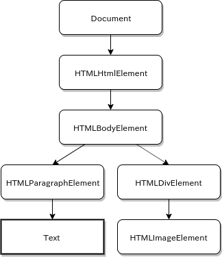

---

## JavaScript実行環境

- JIT型
  - Chakra Legacy（IE11）
  - Chakra（Edge）
  - SpiderMonkey（Firefox）
  - V8（Chrome、Node.js）

- インタプリタ型
  - Ignition（V8）（Android Chrome）

---

<!--_class: lead -->

## ブラウザとWeb技術の移り変わり

---

<!-- W3Schoolsによるウェブブラウザの利用統計 -->

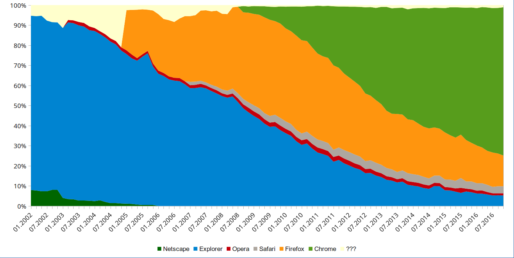

---

## 〜2004年

- IE全盛期（IE 6）
- FLASH黄金時代

この頃のJavaScriptは
「ちょっと動きを加えるもの」

リッチなものは全部FLASH
JavaScriptは無効に設定

WebアプリはLAMPという時代

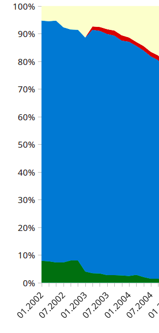

---

## 〜2006年

- IE強い（この頃はIE 7）
- Firefox

- Ajax、jQueryが流行り始める

2005年にGoogle Mapsが登場。


---

## 2005年：XMLHttpRequest（Ajax）

Webブラウザのスクリプト言語（JavaScriptなど）から
サーバとHTTP通信を行うためのに用意されたブラウザのAPI。

Goole MapsでXMLHttpRequestが有名になり、
Ajaxという言葉が生まれる。（Asynchronous JavaScript + XML）

しかしまだクライアントプログラミングの敷居は高い…。

.
※ ほかのWebブラウザのスクリプト言語
　Javaアプレット、VBScript、JScript、ActionScript、Silverlight環境など

---

## 2006年：jQuery

クライアントプログラミングの敷居を一気に下げた存在

- かんたんDOM操作
- かんたんイベント処理
- かんたんAjax
- ブラウザによる挙動の差異を吸収（一番うれしい点）

やりたいことがそこそこ良いカンジでできる（まだまだ現役）

```js
$('#hoge')
```

---

## 2006年：jQueryを活用したWebアプリ開発

なにが辛いか

- 値の管理
- DOMの状態管理
- イベントの発火管理
- ...

コンポーネントが増えるたび、やることが指数関数的に増えていく。

**一部の職人にしか成し得ない超絶技巧プログラミング**

---

## 〜2009年

- PHPフレームワーク乱立問題
- 2004年生まれのRuby on Railsが頭角を表し始める時期
- IE（IE 8）以外のブラウザがシェアを伸ばし始めた時期

タブブラウジング、フィードリーダー、自前のレンダリングエンジン搭載のような独自機能を追加したブラウザがたくさん生まれた。

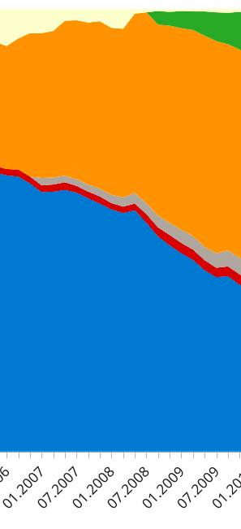

---

## 〜2012年

- IE（IE 9、10）完全に下火
- FuelPHP、Laravelはこのへん
- HTML5/CSS3の対応が進む
  - WebSocketが登場
  - SPAの流れが（！）

- 第一次**クラウド**ブーム

CSS3のメディアクエリ `@media`
→ レスポンシブデザインが主流

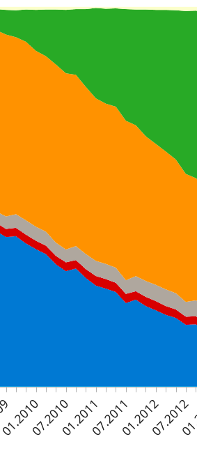

---

## HTML5とSingle Page Application

2011年の時点ですでに多くのブラウザがHTML5に対応していた。
（IE 9、Firefox 3.5、Chrome 3.0など）（HTML5の正式な勧告は2014年）

HTML5では `history.pushState()` を使ってURLの動的書き換えが可能

→ ネイティブアプリのように、ブラウザのページ遷移を使わず
　複数ページあるWebアプリを作成することが可能に！

→ 現在の **シングルページアプリケーション** が登場

---

## jQueryとSingle Page Application

jQuery + Single Page Application…？

- ただでさえ辛いjQuery
- **考慮しないといけない点が増えすぎる**
  - ページ管理
  - ページを跨いだデータ、イベント管理
  - 今までブラウザが管理していた情報をクライアントが管理
    - `history.back()` でのスクロール位置保持など

正気の沙汰ではない…

---

## 〜2016年

- **React**（2013年）
- Docker（2013年）
- Vue.js（2014年）
- TypeScript（2014年）
- Kubernetes（2015年）

jQueryでは辛いため、SPAを作成するためのライブラリが増えるのは自然の流れ…

Reactの台等もあり、SPA +
APIサーバーのアプリが主流に

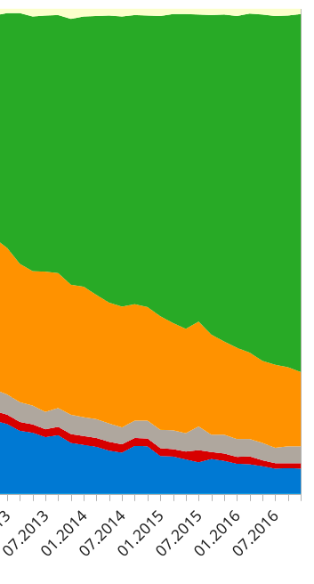

---

## React

- Facebook製ライブラリ
- ユーザインタフェースを構築
- コンポーネント指向

- **Virtual DOM**

jQueryを使って自分でDOMを
操作しなくていい時代が到来！

（一時期ライセンスで燃えてたけどもう問題ないはず…）


---

## Virtual DOM（仮想DOM）

ブラウザのDOMと対になる、Reactなどが保持する構造体。

1. ブラウザでアクションが発生するとReactは仮想DOMを変更
2. 変更前の仮想DOMと変更後の仮想DOMを比較し、差分を抽出
3. ReactがブラウザのDOMを変更

内部でdiff/patchしてくれるため、直接DOMを触る必要がなく、
事前に検証されるためDOMが壊れる心配も無くなった。

→ **把握・管理しないといけないものが減り、SPAが作りやすくなった**

---

## 前半の内容

- ブラウザの仕事
  - レンダリングエンジン
  - JavaScriptエンジン
- ブラウザとWeb技術の移り変わり
  - Ajax、jQuery
  - SPA、React
  - 主要なWeb技術の登場シーン

---

<!--_class: lead -->

## 後編：HTTP、TCPについても ﾁｮｯﾄ 振り返る

①HTTP、TCPを知る

②誰がTCP通信を行っているのか

---

<!--_class: lead -->

## HTTP、TCPを知る

---

## HTTP

主にWebでブラウザ・サーバー間の通信に使われる**プロトコル**。

- http://example.com
- https://google.com

https（HTTP Secure）はHTTPの暗号化通信をする。
（最近のブラウザは `http` だと怒る）


---

## プロトコル？

現代のネットワーク技術を説明するにはレイヤーという概念が便利。
プロトコルの仕事を分けた **TCP/IP参照モデル** などが存在する。

階層|担当|プロトコル例
--|--|--
アプリケーション層|アプリ|**HTTP**, TLS, SMTP, DNS
トランスポート層|OS|**TCP**, UDP
インターネット層|OS|IP（IPv4、IPv6）
ネットワークインターフェイス層|ドライバー|Ethernet, Wifi, PPP

---

## TCP

- 送受信の通信規約
- コネクションを繋げて通信
（電話みたいなもん）
- データロスを検知し、再送
（データの到着を保障）
- 到着順序を保障
- 通信速度を考慮
- いろいろ機能付いてる
  高機能プロトコルTCP

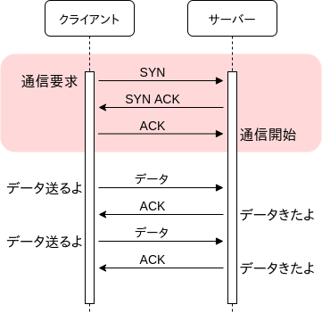

---

## UDP

- 繋がってる相手を管理しない
- 一方的にデータを送りつける
（手紙みたいなもん）
- データロスの検知なし
- 通信速度の制限なし
- 到着順序の管理なし
- 高機能なTCPと比べて
  かなりシンプルで早い

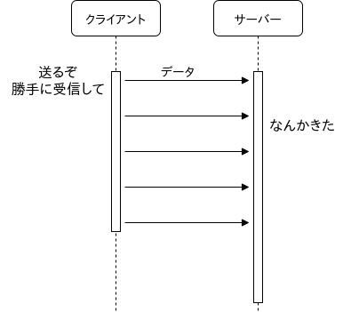

---

## HTTP通信

- HTTPはTCPの上に乗るプロトコル（今後登場するHTTP/3はUDP）
- HTTPリクエスト/レスポンスの書式、ヘッダーの項目などを定めている

- **HTTP（アプリケーション層のプロトコル）は通信方法でなく、**
  **送受信するデータをどう解釈するか定める**
（インターネット間のデータ通信自体はTCP/IPで行われる）
  - どう解釈するかは使用するWebサーバーの実装次第

基本はHTTPリクエストを送り、HTTPレスポンスを受け取る1往復の通信。
（リクエスト/レスポンスは書式通りに書かれた1つのファイルのようなもの）

---

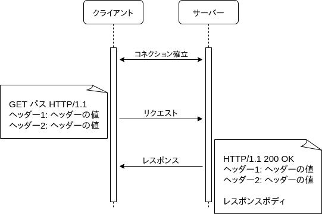

---

（GETにボディを
　含める悪い例。
　ただし、内容の解釈に
　支障はない
　（Webサーバー次第）

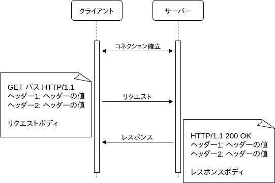

---

## HTTPリクエスト書式

```text
メソッド パス HTTP/バージョン[改行]
ヘッダー1: ヘッダーの値[改行]
ヘッダー2: ヘッダーの値[改行]
[改行]
リクエストボディ（あれば）
```

- メソッド：GET、POST、PUT、DELETE、PATCH、HEAD、OPTION
- パス：`/` 、`/index.html`、`/favicon.ico` などのパス
- ヘッダー： `Host`、`Accept`、`Connection`、`User-Agent` などの設定値
- リクエストボディ：POST、PUTなどでリクエストボディが必要な場合

---

## HTTPリクエスト例

```text
GET / HTTP/1.1
Host: example.com
User-Agent: curl/7.58.0
Accept: */*
```

```text
POST / HTTP/1.1
Host: example.com
User-Agent: curl/7.58.0
Accept: */*
Content-Length: 20
Content-Type: application/json

{"message": "hello."}
```

---

## HTTPレスポンス書式

```text
HTTP/バージョン ステータスコード（数値） ステータスコード（文字） [改行]
ヘッダー1: ヘッダーの値[改行]
ヘッダー2: ヘッダーの値[改行]
[改行]
サーバーレスポンス
```

- ステータスコード：`200 OK`、`400 Bad Request`などの決められたコード
- ヘッダー： `Content-Type`、`Content-Length`、`Date` などの設定値
- サーバーレスポンス：HTMLやJSON、画像のバイナリデータなど

---

## HTTPレスポンス例

```text
HTTP/1.1 200 OK
Content-Type: text/html; charset=UTF-8
Date: Fri, 01 Nov 2019 04:40:07 GMT
Content-Length: 1256
...

<!doctype html>
<html>
<head>
...
```

HTTPレスポンスの書式はGETやPOSTによって変化することがない。
（サーバーレスポンスは多くの場合に存在するが、ない場合もある）

---

HTTP通信の流れ

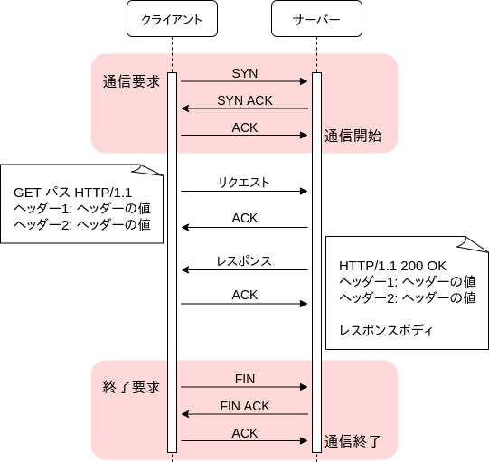

---

<!--_class: lead -->

## 誰がTCP通信を行っているのか

**ソケット** がわかればインターネットがわかる

---

## ソケット

ソケットはIPというプロトコルの上に作られた通信の仕組み。

OSにはシグナル、メッセージキュー、パイプ、共有メモリなど、数多くの
**プロセス間通信機能** が用意されており、ソケットはその一種にあたる。
（ソケットはIP宛先とのプロセス間通信）

- IP（プロトコル）の上で動作する
- TCP、UDP、Unixドメインソケットなどの種類がある

---

## ソケット②

ソケットは他のプロセス間通信機能と少し違っており、通信相手のアドレスとポート番号がわかればローカルのコンピューターだけではなく、**外部のコンピューターとも通信を行える**。（Unixドメインソケットを除く）

インターネット間でのデータの送受信は、このソケットを通じて行う。
糸電話のようなもので、ソケット自体は紙コップの部分とも言える。


---

## ソケット③

- しかしソケットはOSの機能なので、ただのプロセスからは権限不足で使用できない

- そこでプロセスは、OSの機能を使用する **システムコール** を使ってOSからソケットを開くことにした


---

## システムコール

通常のアプリケーションがOSの機能を利用するための仕組み。

（CPU動作モード `特権モード` の
機能を `ユーザーモード` のアプリが利用するための仕組み）

ユーザーモードのプロセスはシステムコールを使ってソケットの読み書きなどを行う。

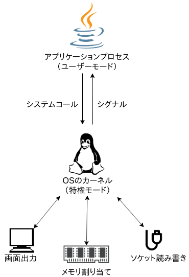

---

## システムコールがないとどうなるか

- システムコールが使えないと
  - 計算した結果を画面に出力することはできない
  - ファイルに保存することもできない
  - 共有メモリに書き出すこともできない
  - ソケット通信を行うこともできない

プロセスがシステムコール無しでできることは、せいぜい電力を消費して熱を発生させるくらい。GUIのウインドウを開いて表示するときも、どこかの段階で必ずシステムコールが必要になる。

---

ソケット通信

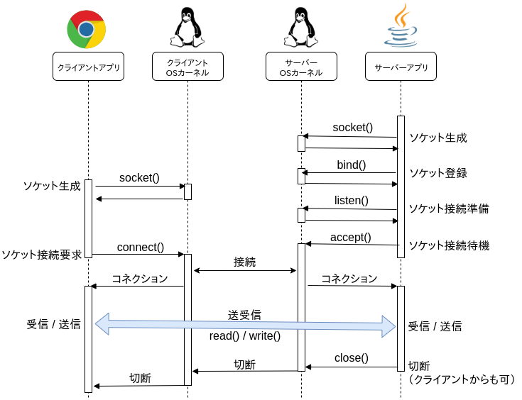

---

## 後半の内容

- HTTP、TCPを知る
  - プロトコル（HTTP、TCP、UDP）
  - HTTPリクエスト、HTTPレスポンス
- 誰がTCP通信を行っているのか
  - ソケット
  - システムコール

---

<!--_class: lead -->

## まとめ

---

## まとめ①

- Single Page Applicationが登場してWebフロント開発がめちゃめちゃ面倒くさくなった
- Virtual DOMを取り入れたReactの登場で、SPA + APIのWebアプリが一般的になった
- jQueryは今でも現役

- ブラウザはChromeが強い


---

## まとめ②

- HTTPはTCP/IPに乗る、
  リクエストとレスポンスで一往復する通信のプロトコル
- インターネットを掘り下げるとただのソケット通信とも言える
- システムコールによってOSカーネルの機能が使用される

- 権限を持たないプロセス単体だと発熱くらいしかできない


