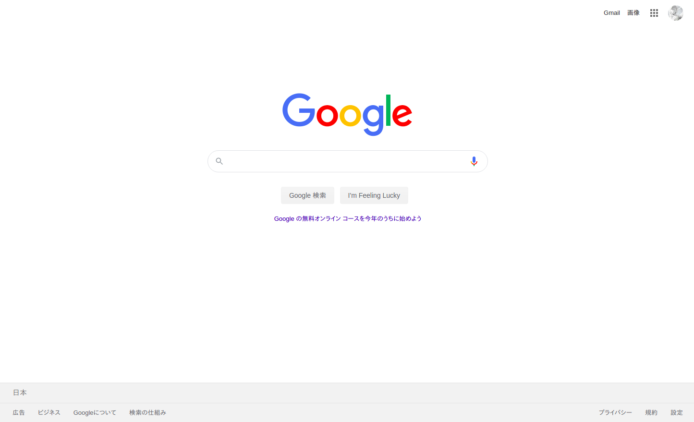
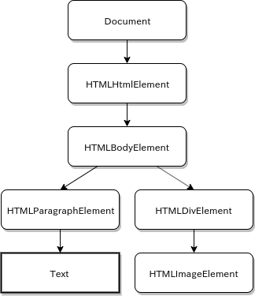
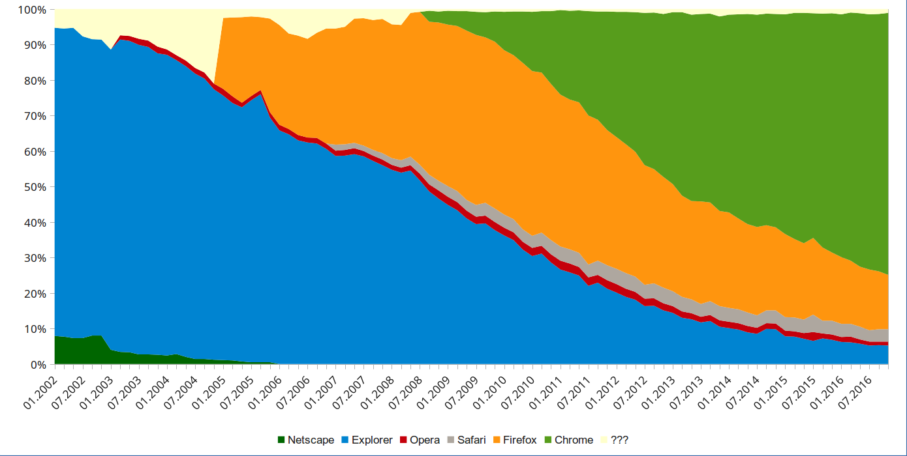
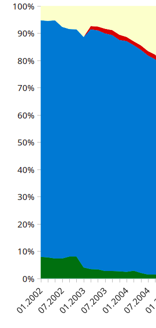
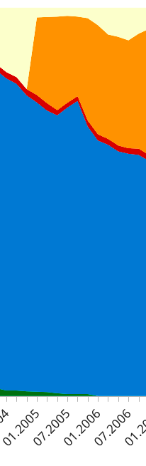
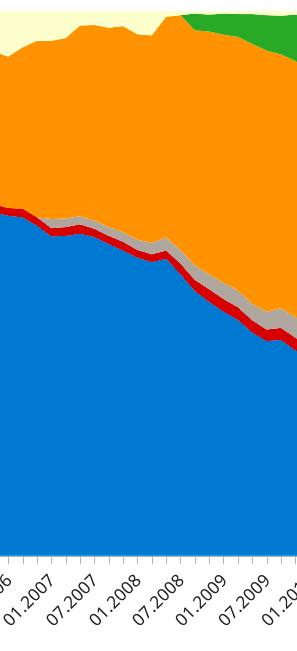
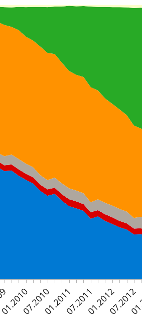
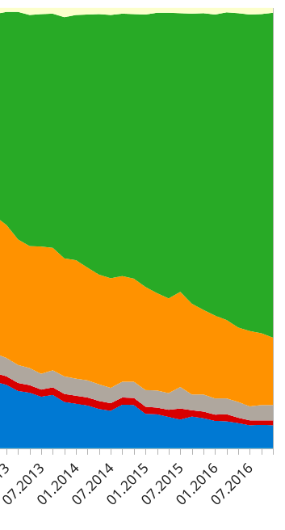

<!--
theme: gaia
_class: lead
-->

# Webの振り返りとHTTP

---

## この資料について

- 目的
  - Webについて分かった気にさせる
    - 前編：Webを振り返って技術の流れを把握する
    - 後編：TCP、HTTPについての理解を深める

---

<!--_class: lead -->

最初に

## 最近のWebアプリ開発事情、棚卸し

Webアプリ開発？　→　HTTPに乗るもの、関連するものすべて

---

## Webアプリ開発事情、棚卸し

- フロントエンドWebアプリフレームワーク（React、Vue、Angular）
- バックエンドWebアプリフレームワーク（Laravel、Rails、Express）
- データベース（RDB、NoSQL）
- クラウド（AWS、GCP、Azure）
- コンテナー（Docker、Kubernetes）
- プロトコル（SSL/TLS、HTTPS、gRPC）
- …

**↑ 混沌**

---

## このスライドの内容

- 前編
  - ブラウザの仕事
  - ブラウザとWeb技術の移り変わり
- 後編
  - ？

- まとめ

---

<!--_class: lead -->

## ブラウザの仕事

---

## 主な機能

HTMLやCSSなどを取得し、
パースして、画面に表示する。
JavaScritpの実行もする。

- レンダリングエンジン
  - HTML解析→DOM Tree
  - CSS解析→Style Rules
  - 画面表示
- JavaScriptエンジン



---

## DOM

Document Object Model

ブラウザ内部でHTMLは
DOMツリーとして保持される。

JavaScriptからDOMのルート
「Document」オブジェクト
を通じてDOMを操作できる！

```js
document.getElementById('foo')

$('#bar').innerHTML = 'sample'
```



---

## JavaScript実行環境

- JIT型
  - Chakra Legacy（IE11）
  - Chakra（Edge）
  - SpiderMonkey（Firefox）
  - V8（Chrome、Node.js）
- インタプリタ型

  - Ignition（V8）（Android Chrome）

---

<!--_class: lead -->

## ブラウザとWeb技術の移り変わり

---

<!-- W3Schoolsによるウェブブラウザの利用統計 -->



---

## 〜2004年

- IE全盛期（IE 6）
- FLASH黄金時代

この頃のJavaScriptは
「ちょっと動きを加えるもの」

リッチなものは全部FLASH！
JavaScriptは無効に設定！

WebアプリはLAMPが最強



---

## 〜2006年

- IEまだ強い（IE 7）
- Firefox

- Ajax、jQuery

2005年にGoogle Mapsが登場。



---

## 2005年：XMLHttpRequest（Ajax）

ウェブブラウザのスクリプト言語（JavaScriptなど）から
サーバとHTTP通信を行うためのに用意されたブラウザのAPI。

Goole MapsでXMLHttpRequestが一躍有名になり、
Ajaxという言葉が生まれる。（Asynchronous JavaScript + XML）

しかしまだクライアントプログラミングの敷居は高い…。

.
※ ウェブブラウザのスクリプト言語
　Javaアプレット、VBScript、JScript、ActionScript、Silverlight環境など

---

## 2006年：jQuery

クライアントプログラミングの敷居を一気に下げた存在

- かんたんDOM操作
- かんたんイベント処理
- かんたんAjax
- ブラウザによる挙動の差異を吸収

やりたいことがそこそこ良いカンジでできる。（まだまだ現役！）

```js
$('#hoge')
```

---

## 2006年：jQuery②

なにが辛いか

- 値の管理
- DOMの状態管理
- イベントの発火管理
- ...

コンポーネントが増えるたび、やることが指数関数的に増えていく。

**一部の職人にしか成し得ない超絶技巧プログラミング**

---

## 〜2009年

- PHPフレームワーク乱立問題
- 2004年生まれのRuby on Railsが頭角を表す
- IE（IE 8）以外のブラウザがシェアを伸ばし始めた時代

タブブラウジング、フィードリーダー、自前のレンダリングエンジン搭載のような独自機能を追加したブラウザがたくさん生まれた。



---

## 〜2012年

- IE（IE 9、10）完全に下火
- Google Chrome躍進
- HTML5/CSS3の対応が進む
  - WebSocketが登場
- FuelPHP、Laravelはこのへん
- **クラウド**ブーム

CSS3のメディアクエリ `@media`
→ レスポンシブデザインが主流



---

## HTML5とSingle Page Application

2011年の時点ですでに多くのブラウザがHTML5に対応していた。
（IE 9、Firefox 3.5、Chrome 3.0など）（HTML5の正式な勧告は2014年）

HTML5では `history.pushState()` を使ってURLの動的書き換えが可能

→ ネイティブアプリのように、ブラウザのページ遷移を使わず
　複数ページあるWebアプリを作成することが可能に！

→ **シングルページアプリケーション**！！

---

## jQueryとSingle Page Application

jQuery + Single Page Application…？

- ただでさえ辛いjQuery
- **考慮しないといけない点が増えすぎる**
  - ページ管理
  - ページを跨いだデータ、イベント管理
  - 今までブラウザが管理していた情報をクライアントが管理
    - `history.back()` でのスクロール位置保持など

正気の沙汰ではない。

---

## 〜2016年

- **React**（2013年）
- Docker（2013年）
- Vue.js（2014年）
- TypeScript（2014年）
- Kubernetes（2015年）

Reactの台等もあり、SPA +
APIサーバーのアプリが主流に



---

## React

- Facebook製ライブラリ
- ユーザインタフェースを構築
- コンポーネント指向

- **VirtualDOM**

jQueryを使って自分でDOMを
操作しなくていい時代が到来！


---

## Virtual DOM（仮想DOM）

ブラウザのDOMと対になる、Reactが保持する構造体。

1. ブラウザでアクションが発生するとReactは仮想DOMを変更
2. 変更前の仮想DOMと変更後の仮想DOMを比較し、差分を抽出
3. ReactがブラウザのDOMを変更

Reactが内部でdiff/patchしてくれるため、直接DOMを触る必要がない。

→ **把握・管理しないといけないものが減り、SPAが作りやすくなった**

---

## 前半の内容

- ブラウザの仕事
  - レンダリングエンジン
  - JavaScriptエンジン
- ブラウザとWeb技術の移り変わり
  - Ajax、jQuery
  - SPA、React
  - 主要なWeb技術の登場シーン
