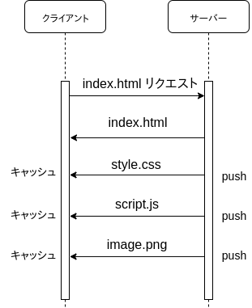
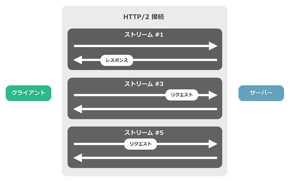
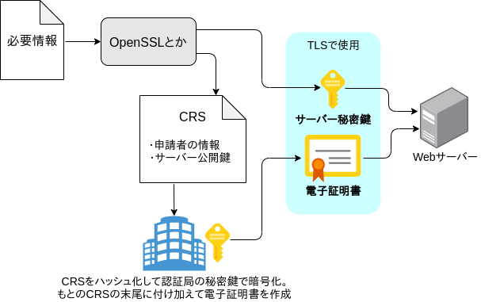
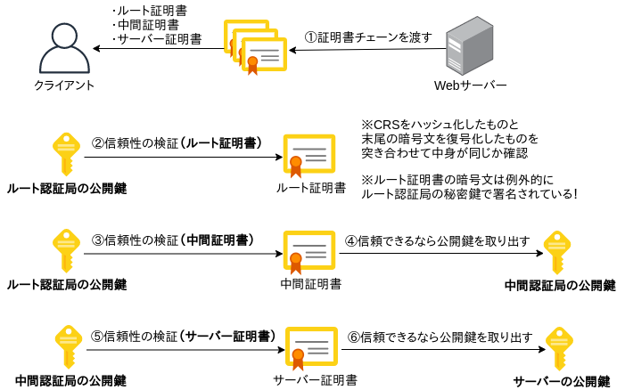
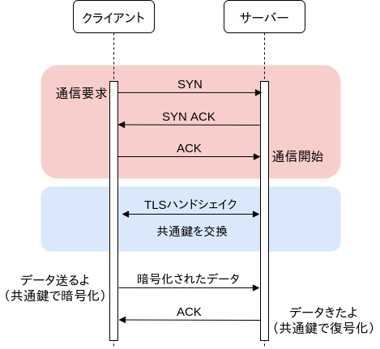
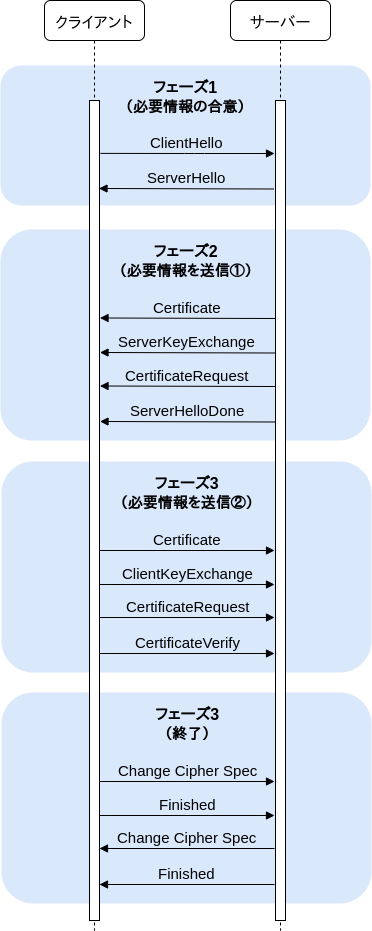
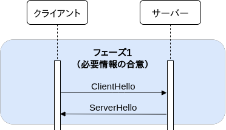
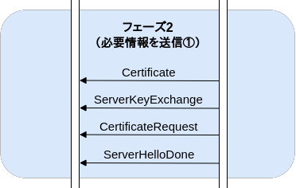
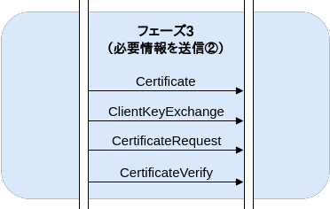
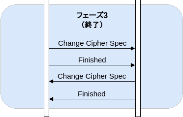

<!--
theme: gaia
_footer: © 2019 shion.ueda
_class: lead
-->

# ﾁｮｯﾄﾜｶﾙ HTTP/2とHTTPS

2019-00-00（WIP）
shion.ueda

---

## 目次

- HTTP年表
- HTTP/2
- HTTPS
- 電子証明書
- TLS
- HTTP/3 概要

---

## HTTP年表

年|ﾊﾞｰｼﾞｮﾝ|説明
-|-|-
1990|HTTP/0.9|GETメソッドのみ。<br>URLで特定されるHTMLを取得するだけのものだった
1996|HTTP/1.0|POSTやDELETEメソッドを追加。<br>フォーマットにヘッダーが登場したのはこの時
1997|HTTP/1.1|Keep-AliveやHTTPパイプラインをサポート。<br>**TLS**を用いてセキュアなHTTPS通信が可能になった
2015|**HTTP/2**|HTTP/1.1との完全な後方互換性を保ちつつ、時代に合わせたさまざまな機能を追加したもの

---

<!--_class: lead -->

## HTTP/2

---

## HTTP/2とは

2015年の5月に公開されたHTTPの新バージョン。
HTTP/1を改良し、大量コンテンツの送受信に対応できる設計となった。
<br>

> 2018年はじめには、世界トップ1000のウェブサイトのうち**ほぼ40%がHTTP/2で動作**しており、Firefoxが発行する**getレスポンスのうちおよそ70%のHTTPSリクエストをHTTP/2が占め**、 ...

HTTP3 explained - https://http3-explained.haxx.se/ja/why-h2.html

---

## HTTP/2の特徴

完全な後方互換性を維持したまま新たな転送手段を提供し、
より少ない通信量で迅速なやり取りを行うことができる仕組み。

- **HTTP/1.1との完全な後方互換性を維持**
  HTTPバージョンが違うサーバー、クライアントでも通信ができる！
  - ポート番号はHTTP/1.1と同じ
    - 80番：HTTP（HTTP/1.1 over TCP、~~HTTP/2 over TCP~~）
    - 443番：HTTPS（HTTP/1.1 over TLS、HTTP/2 over TLS）

- 通信を早くするための仕組みもいろいろ追加

---

## HTTP/2の新機能

- 必要であろうファイルをキャッシュさせる**サーバープッシュ**
- テキストの代わりに**バイナリベース**の通信
- **ストリーム**を用いた非同期な接続の多重化（順序やブロッキングの廃止）

- HTTP2**ヘッダーの圧縮**

---

## サーバープッシュ

**サーバープッシュ**はクライアントが必要とするであろう応答をサーバーが判断し、リクエストの前に送信（**プッシュ**）してキャッシュさせておく技術。

ラウンドトリップを回避する手法だが、すでにキャッシュされている場合はムダな通信となったり、
現代のWebはファイルサイズが大きすぎる問題も…。



---

## バイナリベースの通信

バイナリベースの通信では小さな容量でより多くの内容を転送でき、
より効率的に内容を解析できる。（らしい）

内容の解析が効率的になる理由は、バイナリプロトコルではテキストプロトコルの`空白の処理`や`大文字と小文字の区別`、`改行コード`、`空白のリンク`などを考慮しなくて良くなるため。（らしい）

https://http2.info/faq.html#why-is-http2-binary

バイナリベースの通信では、ヘッダーやリクエスト、レスポンスを**フレーム**
（構造が定められたバイナリのデータ形式）と呼ばれる単位で送受信する

---

## ストリーム


1つのTCPコネクションを用いて複数のリクエスト/レスポンスを**並列で**やり取りする仕組み。
今まではリクエスト/レスポンスが同期的に実行されていたが、ストリームの登場で複数のリクエストを同時に投げて複数のレスポンスを同時に受けられるようになった。（リクエストの多重化）

**1つのTCPソケットに複数のストリーム（データの通り道）ができる**イメージ。
ストリームの中ではフレーム（バイナリのデータ形式）が行き来する。

---

<!--_class: lead -->



---

<!--_class: lead -->

## HTTPS

---

## HTTPSとは

- **TLS**を使用したHTTP通信
  - 通信内容が暗号化されたHTTP

---

## HTTP/2とHTTPS

規格上ではHTTP/2もTLS無しの状態（`http`）で利用できるが、
ブラウザのほとんどがTLS無しのHTTP/2を禁止しているため
HTTP/2は事実上TLS必須（`https://`）という状態になっている。

（プライバシ保護で、通信でHTTPSを必須とする動きが進んでいるため）

||TLS無し（http）|TLS有り（https）
-|-|-
HTTP/1.1|○|○
HTTP/2|×|○

---

<!--_class: lead -->

SSL/TLSの前に…

## 電子証明書

---

## 電子証明書とは

インターネットで持ち主が本人であることを証明するための仕組みで、現実世界で言うところのパスポートのようなもの。信頼された第三者が通信相手を本人であると証明することで、改竄やなりすましを防ぐ。

公開鍵証明書認証局（**CA**、Certificate Authority）と呼ばれる組織によって発行されており、たとえば次のような認証局がある。

- ベリサイン
- シマンテック
- Let's Encrypt

---

## 電子証明書の実体

OpenSSLなどのツールから作成した**CSR**（Certificate Signing Request）をハッシュ化して認証局の秘密鍵で暗号化し、CSRの末尾に付け加えることで電子証明書が完成する。

CSRには次のような情報が含まれる

- コモンネーム：example.com
- 組織名：Cognizant K.K.
- 住所：Osaka
- etc

---



---

## ルート証明書と中間証明書

認証局は一層でなく、**ルート認証局**と**中間認証局**に二層で運用されている。
ルート認証局は中間認証局（Let's Encryptなど）の正しさを証明し、
中間認証局は一般ユーザー（個人や組織）の正しさを証明する。

この連なりを**証明書チェーン**と呼ぶ。


---

## 電子証明書の検証

信頼できるルート証明書（ルート認証局の公開鍵）はOSやブラウザに**標準でインストール**されており、これを使って特定の電子証明書が信頼できるルート認証局に認証されたものであるかどうかを検証できる。

※インターネット経由で証明書をインストールする場合は改竄などの恐れがあり危険。そのため本当に信頼できるルート証明書はOSやブラウザに標準インストールされている。

ルート認証局の公開鍵さえあれば、中間認証局の**証明書から公開鍵を取り出す**ことができ、それを使って一般ユーザーの証明書を検証できる。

---



---

## （電子証明書の認証レベル）

- DV証明書：ドメイン認証（レベル1）
  - ドメインに登録されている登録者を確認することで発行
  - Let's EncryptはDV証明書のみ発行している
  - 個人で取得可能な証明書はこのレベルだけ！
- OV証明書：企業認証（レベル2）
  - ドメインに加え、運営している組織の実在性を証明することで発行
- EV証明書：EV認証（レベル3）
  - ドメインや企業の実在性に加え、所在地の認証を行うことで発行

---

<!--_class: lead -->

## SSL/TLS

HTTPをHTTPSにしてくれるやつ

---

## SSL/TLSとは

**Transport Layer Security**（TLS）はインターネットでセキュアな通信を
行うために開発されているプロトコル。クレジットカード情報などを守る。

- 通信データを暗号化
- 通信データの改ざんを検出
- 通信相手が正しいことを証明
※電子証明書に含まれる公開鍵と電子証明書の有効性チェックを使用

**安全な通信を行うための仕組み！**

---

## SSL/TLS年表

年|ﾊﾞｰｼﾞｮﾝ|説明
-|-|-
1994〜1998|SSL1.0〜SSL3.0|SSLはもう使われていない
1999|TLS1.0|SSL3.0の後継者。SSL3.1とも
2006|TLS1.1|
2008|TLS1.2|今回は1.2あたりの話
2018|TLS1.3|1.3で規格がちょっと変わった？

今現在、一般的にSSLと呼ばれているものは**TLS**のことを指す。
TLSは**SSL/TLS**と呼ばれることもが多いが、SSLとの互換性はない。

---

## TLSの利用用途

HTTPのような、平文で通信をする仕組みと組み合わせて利用する。

通常のプロトコル|ポート|TLSと組み合わせたプロトコル|ポート|
-|-|-|-
HTTP|80|**HTTPS**|443
SMTP|25|SMTPS|465
FTP|20|FTPS|989
IMAP|43|IMAPS|993
POP3|10|POP3S|995

---

## TLS1.2を用いた通信

TCPのコネクション確立後、TLSを使って暗号通信のセッションを確立する。
これを**TLSハンドシェイク**と呼ぶ。

TLSハンドシェイクの目的は
**安全に共通鍵を交換すること**。
セッション確立の過程には
**公開鍵**や**電子証明書**も使用。
（ハイブリッド方式と呼ばれる）



---

## TLSハンドシェイク①

正しく接続されたクライアントと、
特定されない鍵（**共通鍵**）を共有するための仕組み。

中間者攻撃や改竄を検知する仕組みが複数組み込まれるが、**3Wayハンドシェイク**（1.5RTT）に加えてかなりの通信が必要になる。



---

## TLSハンドシェイク②

TLSハンドシェイクは、大きく4つのフェーズに分けられる。

1. 通信に必要な情報の合意
2. 鍵共有に必要な情報の送信
（サーバーからクライアント）
3. 鍵共有に必要な情報の送信
（クライアントからサーバー）
4. セッション確立作業の完了


---

## フェーズ1

接続の要求と、通信で決めないといけない内容の合意を取る。

クライアントはサーバーに
**CipherSuiteのリスト**を渡し、
サーバーはそこから都合の良いCipherSuiteを選んで合意する。

同時に、お互い生成した**乱数**を送り合っておく！（後々使用）



---

## CipherSuite（暗号スイート）？①

暗号通信と一言で言っても、通信は単純なものでない。通信フローは複数の `暗号技術` や `ハッシュ関数` を組み合わせて情報を暗号化している。

TLSではアプリケーション層のデータを `共通鍵方式` で暗号化するが、そこで使用する共通鍵は `公開鍵方式` で暗号化して受け渡しを行っている。しかも、共通鍵暗号や公開鍵暗号のアルゴリズムは1つでなく、複数存在し…

- 共通鍵暗号方式：AES、Blowfish、Camellia、CAST-256、DES...
- 公開鍵暗号方式：RSA、DSA、楕円曲線暗号...

---

## CipherSuite（暗号スイート）？②

**CipherSuite**（**暗号スイート**）はTLSのような複数の暗号方式を利用する
プロトコルで、「この場所にはRSA、この場所にはDES」とあらかじめ決めておいた組み合わせの決まりのことを言う。

TLSのCipherSuiteは次のような文字列で表される。

- `TLS_RSA_WITH_3DES_EDE_CBC_SHA`
- `TLS_RSA_WITH_AES_256_GCM_SHA384`
- `TLS_CHACHA20_POLY1305_SHA256`
- など

---

## フェーズ1②

**ClientHello**では、**CipherSuiteのリスト**とその他の情報を送信。

**ServerHello**では、選択した暗号スイートとその他情報を合わせてクライアントに送信する。

ここで選択された暗号化の形式がこの通信では使用される！

（同時に**乱数**も送り合っている


---

## フェーズ2

サーバーがクライアントに、
通信で必要な情報を送信する。

- **証明書チェーン**
  - **ルート認証局**の証明書
  - **中間認証局**の証明書
  - **サーバー**の証明書



---

## フェーズ3

サーバー証明書の正当性を確認。サーバー公開鍵を取り出し、問題なければ必要な情報をサーバーに送信する。

- サーバー公開鍵で暗号化した乱数 **プリマスタシークレット**
- クライアント証明書
  - サーバーは証明書が正しいものであるか検証する



---

## プリマスタシークレット？

共通鍵を生成するための「マスターシークレット」を生成するための情報。
（46バイトの乱数とバージョン番号をサーバ公開鍵で暗号化したもの。）

クライアントがClientKeyExchangeの工程で生成し、サーバーに送信する。
この際、クライアントもプリマスタシークレット用の乱数を保持しておく。

（サーバーは送信されたプリマスタシークレットを復号化して保持）

---

## 共通鍵の計算

フェーズ3まで完了したなら、TLSハンドシェイクの目的である**共通鍵**を生成することができる！（フェーズ4を始める前に共通鍵を生成しておく！）

ここまで完了した時点で、お互いの手元には3つの乱数が存在する。

- クライアントで生成した乱数（フェーズ1）
- サーバーで生成した乱数（フェーズ1）
- プリマスタシークレット（フェーズ3）

---

## 共通鍵の計算：マスターシークレットを手に入れる

共通鍵の元となるマスターシークレットは、3つの乱数を**複数のハッシュ関数を組み合わせたハッシュ関数**（ここではPRF（疑似乱数関数））に食わせて生成する。生成された文字列の上48桁（48バイト）がマスターシークレットなので切り取る。

```c
master_secret = PRF(プリマスタシークレット, "master secret",
                    クライアント乱数 + サーバー乱数)[0..47];
```

PRFでの計算には2つのハッシュアルゴリズムが組み合わせられており、
どちらか片方のアルゴリズムがセキュアなら結果としてセキュアになる作成。

---

## 共通鍵の計算：キーブロックを手に入れる

生成されたマスターシークレットをもう一度PRF（疑似乱数関数）に食わせることで、キーブロックを手に入れることができる。

```c
key_block = PRF(マスタシークレット, "key expansion",
                クライアント乱数 + サーバー乱数);
```

キーブロックで得られた乱数を指定の長さで切り出して鍵として使用する。

- Client_write_MAC_secret、Server_write_MAC_secret（認証鍵）
- Client_write_key、Server_write_key（暗号鍵）
- Client_write_IV、Server_write_IV（初期ベクトル）

---

## 共通鍵の計算：共通鍵を手に入れる

※クライアンとサーバーで対になる乱数の中身は同じ。
　Client_write_keyとServer_write_keyなど。

生成されたwrite_keyをPRF（疑似乱数関数）にかけることで、
最終的な通信に使用する鍵（共通鍵）を手に入れることができる。

```c
final_write_key = PRF(write_key,
                クライアント乱数 + サーバー乱数);
```

残りのwrite_MAC_secretとwrite_IVは中間者攻撃を防ぐため使用する。

---

## フェーズ4

お互い共通鍵を手に入れたので、ここからの通信は暗号通信で行う宣言**ChangeCipherSpec**を投げ合う。

最後に送信される**Finished**は共通鍵で暗号化されており、これを返すことでハンドシェイクが終了となる。

*共通鍵共有できた！長い！*



---


---

<!--_class: lead -->

## HTTP/3 概要

最近世の中を騒がせている…

---

|バージョンとプロトコル|TCP|UDP
-|-|-
HTTP/1.1|○|×
HTTP/2|○|×
HTTP/3|×|○
