<!--
theme: gaia
_footer: © 2020 shion.ueda
_class: lead
-->

# 今日から始めるAtCoder

2020-2-00（WIP）
shion.ueda

---

## 目次

- 競技プログラミングとは
- 例題を解いてみる
- 最短路問題を解いてみる
- おわりに

---

<!--_class: lead -->

## 競技プログラミングとは

---

hogehoge

---

<!--_class: lead -->

## 例題を解いてみる

---

## ABC086A - Product

### 問題

2つの整数値 **a**, **b** が与えられます。
**a** と **b** の積が偶数か奇数か判定してください。
（偶数なら `Even`、奇数なら `Odd` と出力する。）

### 制約

- 1 ≤ a,b ≤ 10000

https://atcoder.jp/contests/abc086/tasks/abc086_a

---

### 入出力例1

```txt
3 4
```

```txt
Even
```

### 入出力例2

```txt
1 21
```

```txt
Odd
```

---

### 解答例

```go
// Go言語
package main

import "fmt"

func main() {
	var a, b int
	fmt.Scan(&a, &b)

	if a*b%2 == 0 {
		fmt.Println("Even")
	} else {
		fmt.Println("Odd")
	}
}
```

---

<!--_class: lead -->

## 最短路問題を解いてみる

---

## 例

### 問題

上下左右に移動できる2次元盤面上の迷路のスタート地点からゴール地点への最短距離を求めます。迷路の行数 **R** と列数 **C**、スタート座標 **sy**, **sx** とゴール座標 **gy**, **gx**、迷路の情報（空きマス **.** と壁マス **#**）が与えられます。

### 制約

- 盤面は 1 ≦ R ≦ 50 かつ 1 ≦ C ≦ 50
- スタート、ゴール地点は 1 ≦ sy,gy ≦ R かつ 1 ≦ sx,gx ≦ C

---

### 入出力例1

```txt
7 8
2 2
4 5
########
#......#
#.######
#..#...#
#..##..#
##.....#
########
```

```txt
11
```

---

<!--_class: lead -->

最短路問題
↓
## 幅優先探索（BFS）

---

## 幅優先探索（BFS）とは

> 幅優先探索（はばゆうせんたんさく、英: breadth first search）はグラフ理論（Graph theory）において **木構造（tree structure）やグラフ（graph）の探索に用いられるアルゴリズム**。（略）...幅優先探索は解を探すために、**グラフの全てのノードを網羅的に展開・検査** する。

- 最短路や最小手数を求めるためのアルゴリズム
  - 迷路の最短路
  - パズルの最小手数
  - SNSでの、ある人からある人への友人関係最小ステップ数
- 似たものに、深さ優先探索（DFS）がある

---

## 深さ優先

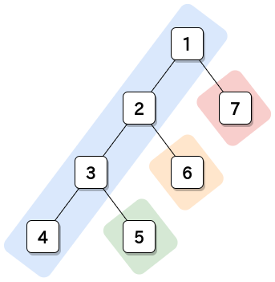

---

## 幅優先

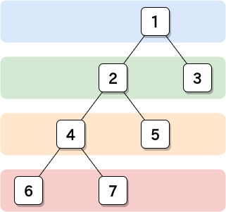

---

## 最短路を求めるアルゴリズム

### 準備

1. **座標を記録するQueue** と、**最短路を記録する配列** を準備する
2. 開始地点の頂点の座標をQueueに入れる

### 探索（Queueの中が空になるまで 3〜5 繰り返し）

3. Queueから頂点をひとつ取り出す
4. 辺で繋がる頂点を調べ、配列に最短路を記録する
5. 調べた頂点をQueueに入れる

---

### 最長路例：アローダイアグラムのクリティカルパス

経路が正の数のみと決まっている場合などは、経路の数値を負の値として考えることで最大値（クリティカルパス）を割り出すこともできる。

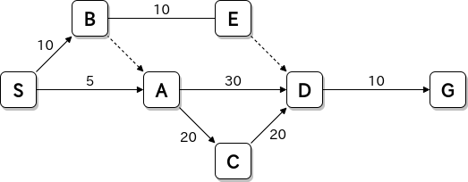

(応用情報技術者平成24年秋期 午前問52 の有向グラフ）

---

<!--_class: lead -->

## 迷路の最短路を求める - 図解

迷路は巨大な無向グラフと言える。

---

迷路は
`[行][列]` の
2次元配列で
表すことが
できる。

ここでは
**S** が `[0][0]`
**G** が `[2][3]`
<br>

答え：
**G** への最短距離は **11**

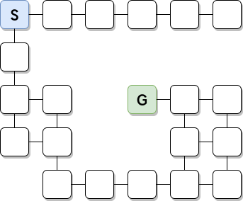

---

### 事前準備

1. **迷路の配列**（道は `.` 壁は `#` の文字で表現）と、
  同じサイズの **最短路を保存する配列** と、
  十分なサイズの **Queue** を用意する。（**y,x** のペアを保存）
2. スタート地点の頂点の **y,x** をQueueに保存する。

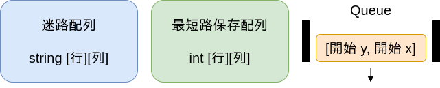

---

### 探索準備

開始地点の座標をQueueに入れて、開始地点の座標を **0** に設定

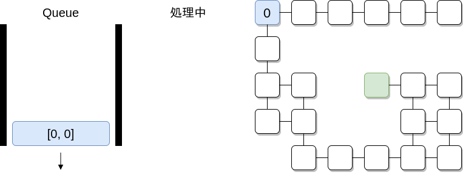

---

### 探索①：Queueから頂点を1つ取り出して処理

隣接する頂点の最短路を **現在地の最短路+1** して座標をQueueに追加。

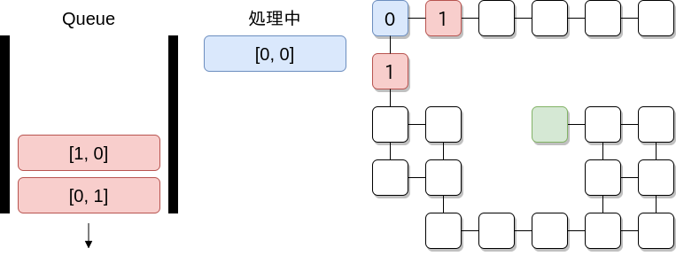

---

### 探索②：Queueから頂点を1つ取り出して処理

隣接する頂点の最短路を **現在地の最短路+1** して座標をQueueに追加。

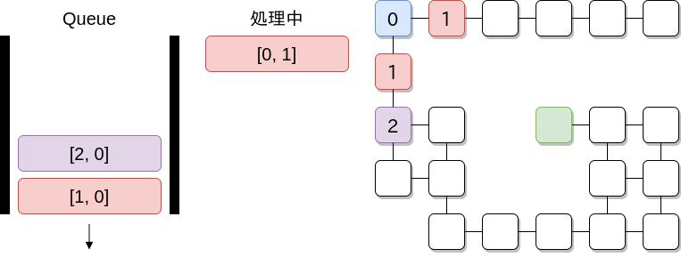

---

### 探索③：Queueから頂点を1つ取り出して処理

隣接する頂点の最短路を **現在地の最短路+1** して座標をQueueに追加。

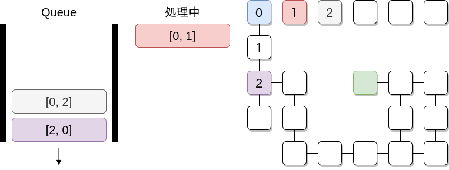

---

### 探索④：Queueから頂点を1つ取り出して処理

隣接する頂点の最短路を **現在地の最短路+1** して座標をQueueに追加。

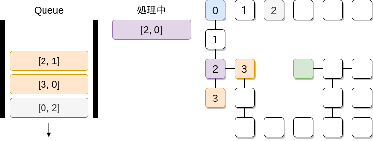

---

<!--_class: lead -->

## ・・・・

---

### 最後の探索：Queueから頂点を1つ取り出して処理

隣接する頂点が無く、Queueが空なので終了。最短路は **11**。

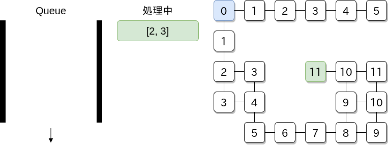

---

### 注意する点

隣接する頂点を処理する際、先に対象の頂点が探索済みかどうかを判定する必要がある。

探索済みの頂点だった際、その回の処理は **スキップ** する。

（BFSでは、最初に設定された
移動数が後からきた移動数より大きくなることはない。）

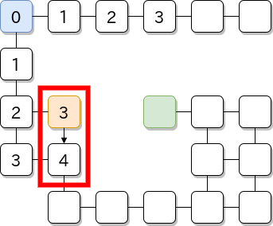

---

<!--_class: lead -->

## 最短路問題 例題

---

## ABC007C - 幅優先探索

### 問題

上下左右に移動できる2次元盤面上の迷路のスタート地点からゴール地点への最短距離を求めます。迷路の行数 **R** と列数 **C**、スタート座標 **sy**, **sx** とゴール座標 **gy**, **gx**、迷路の情報（空きマス **.** と壁マス **#**）が与えられます。

### 制約

- 盤面は 1 ≦ R ≦ 50 かつ 1 ≦ C ≦ 50
- スタート、ゴール地点は 1 ≦ sy,gy ≦ R かつ 1 ≦ sx,gx ≦ C

https://atcoder.jp/contests/abc007/tasks/abc007_3

---

### 入出力例1

```txt
7 8
2 2
4 5
########
#......#
#.######
#..#...#
#..##..#
##.....#
########
```

```txt
11
```

---

## 解答例（Go言語）

```go
package main

import (
	"fmt"
	"strings"
)

type Pair struct {
	x, y int
}

// ↑→↓←
var dy [4]int = [4]int{-1, 0, 1, 0}
var dx [4]int = [4]int{0, 1, 0, -1}
```

---

### 入力の受け取りと、Queueや最短路記録配列の準備

```go
func main() {
	// 入力を受け取る
	var r, c, sy, sx, gy, gx int
	fmt.Scan(&r, &c, &sy, &sx, &gy, &gx)
	stage := make([][]string, r)
	for i := 0; i < r; i++ {
		var tmp string
		fmt.Scan(&tmp)
		stage[i] = strings.Split(tmp, "")
	}

	// Queueの準備
	que := make([]Pair, 0)
	que = append(que, Pair{x: sx - 1, y: sy - 1})
	// 最短路を記録する配列の準備
	var dist [49][49]int // R(1≦R≦50), C(1≦C≦50)
```

---

### BFSを行うループのスタート

```go
	// Queueの中が空になるまで繰り返し
	for len(que) > 0 {
		// Queueからひとつ取り出す
		point := que[0]
		que = que[1:]

		// 上下左右のマスを調べる（dx,dy配列があると4ループで調べられる！）
		for i := 0; i < 4; i++ {
			nx, ny := point.x+dx[i], point.y+dy[i]

			// nx, nyがマイナス値など想定しない数値になった時、
			// または次の場所が壁か探索済みの時はスキップ
			if (nx < 0 && c <= nx && ny < 0 && r <= ny) ||
				(stage[ny][nx] == "#" || dist[ny][nx] != 0) {
				continue
			}
```

---

```go
			// 探索する場所が未探索のマスだった場合、
			// Queueに追加して最短路を記録する！
			que = append(que, Pair{x: nx, y: ny})
			dist[ny][nx] = dist[point.y][point.x] + 1
		}
	}

	// 結果を出力
	fmt.Println(dist[gy-1][gx-1])
}
```

このコードで迷路の最短路を求めることができる。

QueueをStackにするだけでDFS（深さ優先探索）になり、
**迷路のスタート地点がゴール地点と繋がっているか**を調べることができる。

---

## おわりに

